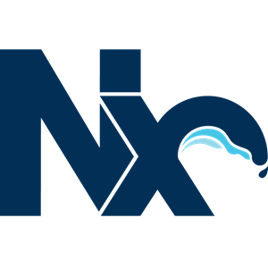

<!--
**hcabel/hcabel** is a ✨ _special_ ✨ repository because its `README.md` (this file) appears on your GitHub profile.

Here are some ideas to get you started:

- 🔭 I’m currently working on ...
- 🌱 I’m currently learning ...
- 👯 I’m looking to collaborate on ...
- 🤔 I’m looking for help with ...
- 😄 Pronouns: ...
-->

# ✨ Welcome to my GitHub profile ✨

#### 💬 Github is the place where I save all my personal project, you can learn about them in my repos or you can also check out my [website](https://hugocabel.com)

### 🌱 I'm currently working on
- A Voxel Game engine called [OpenVoxel](https://github.com/hcabel/RustOpenVoxel) in Rust with Vulkan.

---
### ⚡ My stats

---
### 🛠 My tech stack

#### Web stack

&nbsp;
&nbsp;
&nbsp;
&nbsp;
&nbsp;
&nbsp;
&nbsp;
<picture>
  <source media="(prefers-color-scheme: dark)" srcset="./images/express-original-white.png">
  <source media="(prefers-color-scheme: light)" srcset="https://github.com/devicons/devicon/blob/master/icons/express/express-original.svg">
  
</picture>&nbsp;
<picture>
  <source media="(prefers-color-scheme: dark)" srcset="./images/nextjs-original-white.png">
  <source media="(prefers-color-scheme: light)" srcset="https://github.com/devicons/devicon/blob/master/icons/nextjs/nextjs-original.svg">
  
</picture>&nbsp;
&nbsp;
&nbsp;
&nbsp;
&nbsp;
&nbsp;
&nbsp;
&nbsp;
&nbsp;
&nbsp;

#### Engine stack

  <picture>
    <source media="(prefers-color-scheme: dark)" srcset="https://rustacean.net/assets/rustacean-orig-noshadow.svg">
    <source media="(prefers-color-scheme: light)" srcset="https://github.com/devicons/devicon/blob/master/icons/rust/rust-plain.svg">
    
  </picture>&nbsp;
  &nbsp;
  <picture>
    <source media="(prefers-color-scheme: dark)" srcset="./images/unrealengine-original-white.png">
    <source media="(prefers-color-scheme: light)" srcset="https://github.com/devicons/devicon/blob/master/icons/unrealengine/unrealengine-original.svg">
    
  </picture>&nbsp;
  &nbsp;
  &nbsp;

#### Other

&nbsp;
&nbsp;
&nbsp;
&nbsp;
&nbsp;
&nbsp;

---

### 📫 Contact me:

